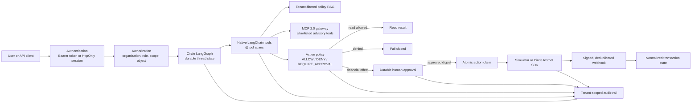
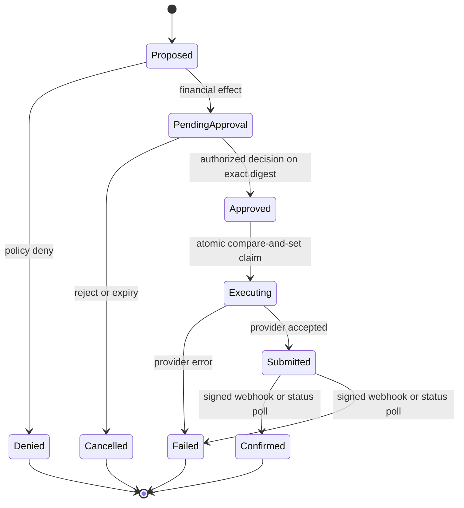

# Architecture

The agent is one durable state machine. RAG, MCP, x402, and provider choice are
capabilities selected by a server-owned profile, not separate agents with
diverging control flow.

## Financial-effect lifecycle

Human approval is a reusable policy outcome. It is not a UI feature and is not
owned by x402, MCP, or RAG. Any sensitive action can produce the same approval
envelope. Resumption re-checks the stored tenant, action version, digest,
reviewer authorization, expiry, and status before the provider is called.

## Trust boundaries

1. The client controls text, IDs, profile requests, and idempotency keys; all
   are untrusted.
2. The authenticated runtime context is created server-side and hidden from
   model-visible tool schemas.
3. The model may propose a tool call but cannot approve or execute an action.
4. MCP output and retrieved text are untrusted data, never instructions.
5. Provider responses and webhooks are normalized and reconciled; submission
   is not finality.
6. The entity secret and API keys exist only in the provider process
   environment and are never placed in graph state, prompts, audit details, or
   browser payloads.
