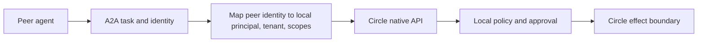

# x402 and A2A placement

x402 is a payment negotiation protocol, not an authorization system. The
`x402-testnet` tool validates an allowed scheme, CAIP-2 testnet network, USDC,
HTTP resource, payee, and amount. It hashes the requirement and maps settlement
into the same Circle transfer action. Policy, human approval, idempotency,
execution, webhooks, and audit remain unchanged.

There is deliberately no x402 mainnet capability. Production work must also
verify facilitator identity, bind the paid resource to the signed requirement,
validate expiry/nonces, persist the settlement proof, and prevent replay across
resources and tenants.

A2A sits above the agent as a delegation envelope:

A2A does not replace MCP: MCP exposes tools/resources to an agent; A2A delegates
tasks between agents. It also does not transmit local authority. A peer must be
authenticated, mapped to a local service principal, tenant-bound, scope-limited,
and audited. A2A implementation is deferred until the native API and security
contract pass production gates; use `docs/api/openapi.yaml` as the stable seam.
